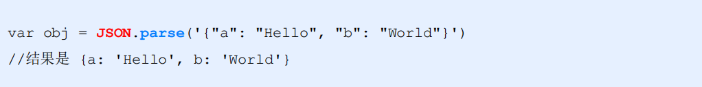
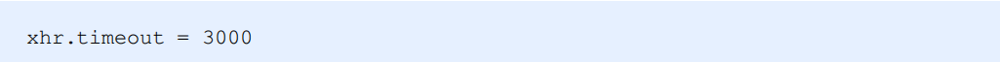

# 目标

- 能够知道如何使用`XMLHttpRequest`发起`Ajax`请求
- 能够知道如何封装自己的Ajax函数
- 能够使用`XMLHttpRequest` `Level2`中提供的新特性
- 能够知道`jQuery`中如何实现文件上传与loading效果
- 能够知道如何使用`axios`发起Ajax请求

# `XMLHttpRequest`的基本使用

## 什么`XMLHttpRequest`

`XMLHttpRequest`（简称 `xhr`）是浏览器提供的 `Javascript` 对象，通过它，可以**请求服务器上的数据资源**。之

前所学的 `jQuery` 中的 Ajax 函数，就是基于 `xhr` 对象封装出来的


## 使用`xhr`发起GET请求（⭐⭐⭐）

**步骤**

- 创建 `xhr` 对象

- 调用 `xhr.open()` 函数

- 调用 `xhr.send()` 函数

- 监听 `xhr.onreadystatechange` 事件

```javascript
// 1. 创建 XHR 对象
var xhr = new XMLHttpRequest()
// 2. 调用 open 函数
xhr.open('GET', 'http://www.liulongbin.top:3006/api/getbooks')
// 3. 调用 send 函数
xhr.send()
// 4. 监听 onreadystatechange 事件
xhr.onreadystatechange = function () {
  if (xhr.readyState === 4 && xhr.status === 200) {
     // 获取服务器响应的数据
     console.log(xhr.responseText)
   }
}
```

### 了解`xhr`对象的`readyState`属性

`XMLHttpRequest` 对象的 `readyState` 属性，用来表示**当前 `Ajax` 请求所处的状态**。每个 `Ajax` 请求必然处于以

下状态中的一个：


### 使用`xhr`发起带参数的GET请求

使用 `xhr` 对象发起带参数的 `GET` 请求时，只需在调用 `xhr.open` 期间，为 `URL` 地址指定参数即可：


这种在 URL 地址后面拼接的参数，叫做**查询字符串**。

```javascript
var xhr = new XMLHttpRequest()
xhr.open('GET', 'http://www.liulongbin.top:3006/api/getbooks?id=1')
xhr.send()
xhr.onreadystatechange = function () {
  if (xhr.readyState === 4 && xhr.status === 200) {
     console.log(xhr.responseText)
  }
}
```

### 查询字符串

#### 什么是查询字符串

**定义：**查询字符串（URL 参数）是指在 URL 的末尾加上用于向服务器发送信息的字符串（变量）。

**格式：**将英文的 **?** 放在`URL` 的末尾，然后再加上 **参数＝值** ，想加上多个参数的话，使用 **&** 符号进行分隔。以

这个形式，可以将想要发送给服务器的数据添加到 `URL` 中。


#### GET请求携带参数的本质

无论使用 `$.ajax()`，还是使用 `$.get()`，又或者直接使用 `xhr` 对象发起 `GET` 请求，当需要携带参数的时候，本质上，都是直接将参数以查询字符串的形式，追加到 URL 地址的后面，发送到服务器的。


## URL编码与解码

### 什么是URL编码

`URL` 地址中，只允许出现英文相关的字母、标点符号、数字，因此，在 `URL` 地址中不允许出现中文字符。

如果 URL 中需要包含中文这样的字符，则必须对中文字符进行**编码**（转义）。

**URL编码的原则**：使用安全的字符（没有特殊用途或者特殊意义的可打印字符）去表示那些不安全的字符。

URL编码原则的通俗理解：使用英文字符去表示非英文字符


### 如何对URL进行编码与解码

浏览器提供了 `URL` 编码与解码的 `API`，分别是：

-  `encodeURI()` 编码的函数

-  `decodeURI()` 解码的函数


**由于浏览器会自动对 URL 地址进行编码操作，因此，大多数情况下，程序员不需要关心 URL 地址的编码与解码操作**

更多关于 URL 编码的知识，请参考如下博客：

https://blog.csdn.net/Lxd_0111/article/details/78028889

## 使用`xhr`发起`POST`请求（⭐⭐⭐）

**步骤**

- 创建 `xhr` 对象

- 调用 `xhr.open()` 函数

- **设置 Content-Type 属性**（固定写法）

- 调用 `xhr.send()` 函数，**同时指定要发送的数据**

- 监听 `xhr.onreadystatechange` 事件

```javascript
// 1. 创建 xhr 对象
var xhr = new XMLHttpRequest()
// 2. 调用 open 函数
xhr.open('POST', 'http://www.liulongbin.top:3006/api/addbook')
// 3. 设置 Content-Type 属性（固定写法）
xhr.setRequestHeader('Content-Type', 'application/x-www-form-urlencoded')
// 4. 调用 send 函数
xhr.send('bookname=水浒传&author=施耐庵&publisher=上海图书出版社')
// 5. 监听事件
xhr.onreadystatechange = function () {
  if (xhr.readyState === 4 && xhr.status === 200) {
    console.log(xhr.responseText)
  }
}
```

# 数据交换格式

## 什么是数据交换格式

数据交换格式，就是**服务器端**与**客户端**之间进行**数据传输与交换的格式**

前端领域，经常提及的两种数据交换格式分别是 `XML` 和 `JSON`。其中 `XML` 用的非常少，所以，我们重点要学

习的数据交换格式就是 `JSON`


## XML

### 什么是XML

`XML` 的英文全称是 `EXtensible Markup Language`，即**可扩展标记语言**。因此，`XML` 和 `HTML` 类似，

也是一种标记语言。


### XML和HTML的区别

`XML` 和 `HTML` 虽然都是标记语言，但是，它们两者之间没有任何的关系。

- `HTML` 被设计用来描述网页上的**内容**，是网页内容的载体

- `XML` 被设计用来**传输和存储数据**，是数据的载体


### XML的缺点


-  `XML` 格式臃肿，和数据无关的代码多，体积大，传输效率低

-  在 `Javascript` 中解析 `XML` 比较麻烦

## `JSON（⭐⭐⭐）`

### 什么是`JSON`

**概念：**`JSON` 的英文全称是 `JavaScript Object Notation`，即“**JavaScript 对象表示法**”。简单来讲，

`JSON` 就是 `Javascript` 对象和数组的字符串表示法，它使用文本表示一个 `JS` 对象或数组的信息，因此，

**`JSON` 的本质是字符串**。

**作用：**`JSON` 是一种轻量级的文本数据交换格式，在作用上类似于 `XML`，专门用于存储和传输数据，但

是 `JSON` 比 `XML` 更小、更快、更易解析。

**现状：**`JSON` 是在 2001 年开始被推广和使用的数据格式，到现今为止，`JSON` 已经成为了主流的数据交

换格式

### `JSON`的两种结构

`JSON` 就是用字符串来表示 `Javascript` 的对象和数组。所以，`JSON` 中包含**对象**和**数组**两种结构，通过这

两种结构的相互嵌套，可以表示各种复杂的数据结构。

#### **对象结构**

对象结构在 `JSON` 中表示为 `{ }` 括起来的内容。数据结构为 `{ key: value, key: value, … }` 的键

值对结构。其中，`key` 必须是使用英文的双引号包裹的字符串，`value` 的数据类型可以是**数字、字符串、**

**布尔值、null、数组、对象**6种类型。


#### **数组结构**

数组结构在 `JSON` 中表示为 `[ ]` 括起来的内容。数据结构为 `[ "java", "javascript", 30, true … ]` 。

数组中数据的类型可以是**数字、字符串、布尔值、null、数组、对象**6种类型。


###  `JSON`语法注意事项

① 属性名必须使用双引号包裹

② 字符串类型的值必须使用双引号包裹

③ `JSON` 中不允许使用单引号表示字符串

④ `JSON` 中不能写注释

⑤ `JSON` 的最外层必须是对象或数组格式

⑥ 不能使用 `undefined` 或函数作为 `JSON` 的值

**`JSON` 的作用：**在计算机与网络之间存储和传输数据。

**`JSON` 的本质：**用字符串来表示 `Javascript` 对象数据或数组数据

### `JSON`和`JS`对象的关系

`JSON` 是 `JS` 对象的字符串表示法，它使用文本表示一个 `JS` 对象的信息，本质是一个字符串。例如：


### `JSON`和`JS`对象的互转

要实现从 `JSON` 字符串转换为 `JS` 对象，使用 `JSON.parse()` 方法：



要实现从 `JS` 对象转换为 `JSON` 字符串，使用 `JSON.stringify()` 方法：


**应用场景**

```javascript
var xhr = new XMLHttpRequest()
xhr.open('GET', 'http://www.liulongbin.top:3006/api/getbooks')
xhr.send()
xhr.onreadystatechange = function () {
  if (xhr.readyState === 4 && xhr.status === 200) {
    console.log(xhr.responseText)
    console.log(typeof xhr.responseText)
    var result = JSON.parse(xhr.responseText)
    console.log(result)
  }
}
```

### 序列化和反序列化

把**数据对象** **转换为** **字符串**的过程，叫做**序列化**，例如：调用 `JSON.stringify()` 函数的操作，叫做 `JSON` 序列化。

把**字符串** **转换为** **数据对象**的过程，叫做**反序列化**，例如：调用 `JSON.parse()` 函数的操作，叫做 `JSON` 反序列化。

# 封装自己的Ajax函数（⭐⭐⭐）

## 要实现的效果


## 定义options参数选项

`itheima()` 函数是我们自定义的 `Ajax` 函数，它接收一个配置对象作为参数，配置对象中可以配置如下属性：

- `method` 请求的类型

- `url` 请求的 `URL` 地址

- `data` 请求携带的数据

- `success` 请求成功之后的回调函数

## 处理data参数

需要把 `data` 对象，转化成查询字符串的格式，从而提交给服务器，因此提前定义 `resolveData` 函数如下：

```javascript
/*** 处理 data 参数
* @param {data} 需要发送到服务器的数据
* @returns {string} 返回拼接好的查询字符串 name=zs&age=10
*/
function resolveData(data) {
  var arr = []
  for (var k in data) {
    var str = k + '=' + data[k]
    arr.push(str)
  }

  return arr.join('&')
}
```

## 定义`itheima`函数

在 `itheima()` 函数中，需要创建 `xhr` 对象，并监听 `onreadystatechange` 事件：

```javascript
function itheima(options) {
  var xhr = new XMLHttpRequest()

  // 把外界传递过来的参数对象，转换为 查询字符串
  var qs = resolveData(options.data)
  // 注册监听
  xhr.onreadystatechange = function () {
  // 注册监听
    if (xhr.readyState === 4 && xhr.status === 200) {
      // 把服务器的json字符串转成js对象
      var result = JSON.parse(xhr.responseText)
      options.success(result)
    }
  }
}
```

## 判断请求的类型

不同的请求类型，对应 `xhr` 对象的不同操作，因此需要对请求类型进行 `if … else …` 的判断：

```javascript
if (options.method.toUpperCase() === 'GET') {
  // 发起GET请求
  xhr.open(options.method, options.url + '?' + qs)
  xhr.send()
} else if (options.method.toUpperCase() === 'POST') {
  // 发起POST请求
  xhr.open(options.method, options.url)
  xhr.setRequestHeader('Content-Type', 'application/x-www-form-urlencoded')
  xhr.send(qs)
}
```

# `XMLHttpRequest Level2`的新特性

## 旧版`XMLHttpRequest`的缺点

- 只支持文本数据的传输，无法用来读取和上传文件

- 传送和接收数据时，没有进度信息，只能提示有没有完成

##  `XMLHttpRequest Level2`的新功能

- 可以设置 HTTP 请求的时限

- 可以使用 `FormData` 对象管理表单数据

- 可以上传文件

- 可以获得数据传输的进度信息

## 设置`HTTP`请求时限

有时，`Ajax` 操作很耗时，而且无法预知要花多少时间。如果网速很慢，用户可能要等很久。新版本的 `XMLHttpRequest` 对象，增加了 `timeout` 属性，可以设置 `HTTP` 请求的时限：



上面的语句，将最长等待时间设为 3000 毫秒。过了这个时限，就自动停止HTTP请求。与之配套的还有一个

`timeout` 事件，用来指定回调函数：


```javascript
<script>
  var xhr = new XMLHttpRequest()
  // 设置 超时时间
  xhr.timeout = 30
  // 设置超时以后的处理函数
  xhr.ontimeout = function () {
    console.log('请求超时了！')
  }
  xhr.open('GET', 'http://www.liulongbin.top:3006/api/getbooks')
  xhr.send()
  xhr.onreadystatechange = function () {
    if (xhr.readyState === 4 && xhr.status === 200) {
      console.log(xhr.responseText)
    }
  }
</script>
```

## `FormData`对象管理表单数据

Ajax 操作往往用来提交表单数据。为了方便表单处理，`HTML5` 新增了一个 `FormData` 对象，可以模拟表单操作：

```javascript
 // 1. 新建 FormData 对象
 var fd = new FormData()
 // 2. 为 FormData 添加表单项
 fd.append('uname', 'zs')
 fd.append('upwd', '123456')
 // 3. 创建 XHR 对象
 var xhr = new XMLHttpRequest()
 // 4. 指定请求类型与URL地址
 xhr.open('POST', 'http://www.liulongbin.top:3006/api/formdata')
 // 5. 直接提交 FormData 对象，这与提交网页表单的效果，完全一样
 xhr.send(fd)
```

## `FormData`对象管理表单数据

`FormData`对象也可以用来获取网页表单的值，示例代码如下：

```javascript
// 获取表单元素
var form = document.querySelector('#form1')
// 监听表单元素的 submit 事件
form.addEventListener('submit', function(e) {
 e.preventDefault()
 // 根据 form 表单创建 FormData 对象，会自动将表单数据填充到 FormData 对象中
 var fd = new FormData(form)
 var xhr = new XMLHttpRequest()
 xhr.open('POST', 'http://www.liulongbin.top:3006/api/formdata')
 xhr.send(fd)
 xhr.onreadystatechange = function() {}
})
```

## 上传文件

新版 `XMLHttpRequest` 对象，不仅可以发送文本信息，还可以上传文件。

**实现步骤：**

① 定义 `UI` 结构

② 验证是否选择了文件

③ 向 `FormData` 中追加文件

④ 使用 `xhr` 发起上传文件的请求

⑤ 监听 `onreadystatechange` 事件

### 定义`UI`结构

```html
 <!-- 1. 文件选择框 -->
 <input type="file" id="file1" />
 <!-- 2. 上传按钮 -->
 <button id="btnUpload">上传文件</button>
 <br />
 <!-- 3. 显示上传到服务器上的图片 -->
 
```

### 验证是否选择了文件

```javascript
// 1. 获取上传文件的按钮
var btnUpload = document.querySelector('#btnUpload')
// 2. 为按钮添加 click 事件监听
btnUpload.addEventListener('click', function() {
 // 3. 获取到选择的文件列表
 var files = document.querySelector('#file1').files
 if (files.length <= 0) {
 return alert('请选择要上传的文件！')
 }
 // ...后续业务逻辑
})
```

### 向`FormData`中追加文件

```javascript
// 1. 创建 FormData 对象
var fd = new FormData()
// 2. 向 FormData 中追加文件
fd.append('avatar', files[0])
```

### 使用 `xhr` 发起上传文件的请求

```javascript
// 1. 创建 xhr 对象
var xhr = new XMLHttpRequest()
// 2. 调用 open 函数，指定请求类型与URL地址。其中，请求类型必须为 POST
xhr.open('POST', 'http://www.liulongbin.top:3006/api/upload/avatar')
// 3. 发起请求
xhr.send(fd)
```

###  监听`onreadystatechange`事件

```javascript
xhr.onreadystatechange = function() {
 if (xhr.readyState === 4 && xhr.status === 200) {
 	 var data = JSON.parse(xhr.responseText)
     if (data.status === 200) { // 上传文件成功
     // 将服务器返回的图片地址，设置为  标签的 src 属性
        document.querySelector('#img').src = 'http://www.liulongbin.top:3006' + data.url
     } else { // 上传文件失败
         console.log(data.message)
     }
 }
}
```

### 显示文件上传进度

#### 计算文件上传进度

新版本的 `XMLHttpRequest` 对象中，可以通过监听 `xhr.upload.onprogress` 事件，来获取到文件的上传进度。语法格式如下：

```javascript
// 创建 XHR 对象
var xhr = new XMLHttpRequest()
// 监听 xhr.upload 的 onprogress 事件
xhr.upload.onprogress = function(e) {
     // e.lengthComputable 是一个布尔值，表示当前上传的资源是否具有可计算的长度
     if (e.lengthComputable) {
         // e.loaded 已传输的字节
         // e.total 需传输的总字节
         var percentComplete = Math.ceil((e.loaded / e.total) * 100)
     }
 }
```

#### 导入需要的库

```html
<link rel="stylesheet" href="./lib/bootstrap.css" />
<script src="./lib/jquery.js"></script>
```

#### 基于`Bootstrap`渲染进度条

```html
 <!-- 进度条 -->
 <div class="progress" style="width: 500px; margin: 10px 0;">
     <div class="progress-bar progress-bar-info progress-barstriped active" id="percent" style="width: 0%">
     0%
     </div>
 </div>
```

#### 动态设置到进度条上

```javascript
xhr.upload.onprogress = function(e) {
     if (e.lengthComputable) {
         // 1. 计算出当前上传进度的百分比
         var percentComplete = Math.ceil((e.loaded / e.total) * 100)
         $('#percent')
         // 2. 设置进度条的宽度
         .attr('style', 'width:' + percentComplete + '%')
         // 3. 显示当前的上传进度百分比
         .html(percentComplete + '%')
     }
}
```

### 监听上传完成的事件

```javascript
xhr.upload.onload = function() {
     $('#percent')
     // 移除上传中的类样式
     .removeClass()
     // 添加上传完成的类样式
     .addClass('progress-bar progress-bar-success')
}
```

#  `jQuery`高级用法- `jQuery`实现文件上传（⭐⭐⭐）

## 定义`UI`结构

```html
 <!-- 导入 jQuery -->
 <script src="./lib/jquery.js"></script>
 <!-- 文件选择框 -->
 <input type="file" id="file1" />
 <!-- 上传文件按钮 -->
 <button id="btnUpload">上传</button>
```

## 验证是否选择了文件

```javascript
$('#btnUpload').on('click', function() {
     // 1. 将 jQuery 对象转化为 DOM 对象，并获取选中的文件列表
     var files = $('#file1')[0].files
     // 2. 判断是否选择了文件
     if (files.length <= 0) {
     	return alert('请选择图片后再上传！‘)
     }
})
```

## 向`FormData`中追加文件

```javascript
// 向 FormData 中追加文件
var fd = new FormData()
fd.append('avatar', files[0])
```

##  使用`jQuery`发起上传文件的请求

```javascript
$.ajax({
     method: 'POST',
     url: 'http://www.liulongbin.top:3006/api/upload/avatar',
     data: fd,
     // 不修改 Content-Type 属性，使用 FormData 默认的 Content-Type 值
     contentType: false,
     // 不对 FormData 中的数据进行 url 编码，而是将 FormData 数据原样发送到服务器
     processData: false,
     success: function(res) {
     	console.log(res)
     }
})
```

## `jQuery`实现`loading`效果

### `ajaxStart(callback)`

`Ajax` 请求**开始**时，执行 `ajaxStart` 函数。可以在 `ajaxStart` 的 `callback` 中显示 `loading` 效果，示例代码如下：

```javascript
// 自 jQuery 版本 1.8 起，该方法只能被附加到文档
$(document).ajaxStart(function() {
    $('#loading').show()
})
```

**注意：** `$(document).ajaxStart()` 函数**会监听当前文档内所有的 Ajax 请求**。

### `ajaxStop(callback)`

`Ajax` 请求**结束**时，执行 `ajaxStop` 函数。可以在 `ajaxStop` 的 `callback` 中隐藏 `loading` 效果，示例代码如下：

```javascript
// 自 jQuery 版本 1.8 起，该方法只能被附加到文档
$(document).ajaxStop(function() {
    $('#loading').hide()
})
```

# `axios（⭐⭐⭐）`

## 什么是`axios`

`Axios` 是专注于**网络数据请求**的库。

相比于原生的 `XMLHttpRequest` 对象，`axios` **简单易用**。

相比于 `jQuery`，`axios` 更加**轻量化**，只专注于网络数据请求。

## `axios`发起GET请求

`axios` 发起 `get` 请求的语法：

```javascript
axios.get('url', { params: { /*参数*/ } }).then(callback)
```

**具体的请求示例如下：**

```javascript
// 请求的 URL 地址
var url = 'http://www.liulongbin.top:3006/api/get'
// 请求的参数对象
var paramsObj = { name: 'zs', age: 20 }
// 调用 axios.get() 发起 GET 请求
axios.get(url, { params: paramsObj }).then(function(res) {
     // res.data 是服务器返回的数据
     var result = res.data
     console.log(res)
})
```

## `axios`发起`POST`请求

`axios` 发起 `post` 请求的语法：

```javascript
axios.post('url', { /*参数*/ }).then(callback)
```

**具体的请求示例如下：**

```javascript
// 请求的 URL 地址
var url = 'http://www.liulongbin.top:3006/api/post'
// 要提交到服务器的数据
var dataObj = { location: '北京', address: '顺义' }
// 调用 axios.post() 发起 POST 请求
axios.post(url, dataObj).then(function(res) {
     // res.data 是服务器返回的数据
     var result = res.data
     console.log(result)
})
```

## 直接使用`axios`发起请求

`axios` 也提供了类似于 `jQuery` 中 `$.ajax()` 的函数，语法如下：

```javascript
axios({
 method: '请求类型',
 url: '请求的URL地址',
 data: { /* POST数据 */ },
 params: { /* GET参数 */ }
}).then(callback)
```

**发起get请求**

```javascript
document.querySelector('#btn3').addEventListener('click', function () {
      var url = 'http://www.liulongbin.top:3006/api/get'
      var paramsData = { name: '钢铁侠', age: 35 }
      axios({
        method: 'GET',
        url: url,
        params: paramsData
      }).then(function (res) {
        console.log(res.data)
      })
})
```

**发起post请求**

```javascript
document.querySelector('#btn4').addEventListener('click', function () {
  axios({
    method: 'POST',
    url: 'http://www.liulongbin.top:3006/api/post',
    data: {
      name: '娃哈哈',
      age: 18,
      gender: '女'
    }
  }).then(function (res) {
    console.log(res.data)
  })
})
```

