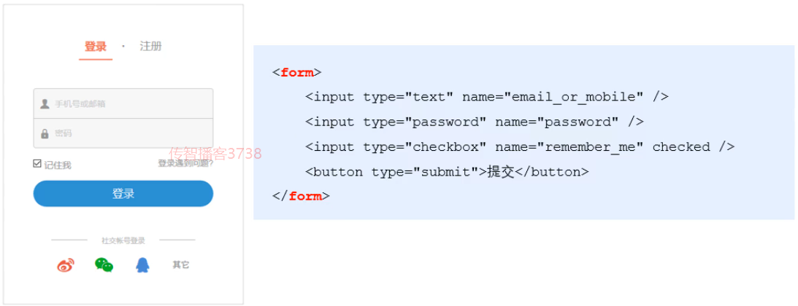

# 目标

- 能够说出form表单的常用属性
- 能够知道如何阻止表单的默认提交行为
- 能够知道如何使用`jQuery`快速获取表单数据
- 能够知道如何安装和使用模板引擎
- 能够知道模板引擎的实现原理

# Form表单的基本使用

## 什么是表单

表单在网页中主要负责 **数据采集功能**。HTML中`<form>`标签，就是用于采集用户输入的信息，并通过 `<form> `标签的提交操作，把采集的信息提交到服务器端进行处理



## 表单的组成部分


- 表单标签
- 表单域：包含了文本框，密码框，隐藏域，都行文本框，复选框，单选框，下拉选择框和文件上传框等等
- 表单按钮：通过设置`type`属性为`submit`来触发`form`表单的提交

## `<form>` 标签的属性(⭐⭐⭐)

### `action`

`action` 属性用来规定当提交表单时，**向何处发送表单数据**。

`action` 属性的值应该是后端提供的一个URL地址，这个URL地址专门负责接收表单提交过来的数据。

当 `<form>`表单在未制定 `action` 属性值的清空下，`action`的默认值为当前页面的 `URL` 地址

**注意:** 当提交表单后，会立即跳转到 `action` 属性指定的 `URL` 地址

### `target`

`target` 属性用来规定 在何处打开 `action URL`

它的可选值有5个，默认情况下，target的值是 _self，表示在相同的框架中打开 action URL


### `method`

`method` 属性用来规定 **以何种方式** 把表单数据提交到 action URL

它的可选值有两个，分别是 `get` 和 `post`

默认情况下，`method`的值为 `get`， 表示通过`URL`地址的形式，把表单数据提交到 `action URL`

**注意：**

- get 方式适合用来提交**少量的**，**简单的**数据
- post 方式适合用来提交**大量的**，**复杂的**，或包含**文件上传**的数据

### `enctype`

`enctype`属性用来规定在 **发送表单数据之前如何对数据进行编码**

它的可选值有三个，默认情况下，`enctype`的值为 `application/x-www-form-urlencoded`，表示在发送前编码的所有字符


## 表单的同步提交及缺点

### 什么是表单的同步提交

通过点击 submit 按钮，触发表单提交的操作，从而使页面跳转到 `action URL` 的行为，叫做表单的同步提交

### 表单同步提交的缺点

- `<form>` 表单同步提交后，整个页面会发生跳转，**跳转到 action URL 所指向的地址**，用户体验很差
- `<form>` 表单同步提交后，页面之前的状态和数据会丢失

**如何解决呢？**

**表单只复杂采集数据，Ajax负责将数据提交到服务器**

# 通过Ajax提交表单数据

## 监听表单提交事件

在 `jQuery` 中，可以使用如下两种方式，监听到表单的提交事件


## 阻止表单默认提交行为(⭐⭐⭐)

当监听到表单的提交事件以后，可以调用事件对象的 `event.preventDefault()` 函数，来阻止表单的提交和页面的跳转


## 如何快速获取表单数据(⭐⭐⭐)

### `serialize()` 函数

为了简化表单中数据的获取操作，`jQuery`提供了 `serialize()` 函数，语法格式如下：


**好处：**可以一次性获取表单的数据

**示例代码：**


**注意：**在使用 serialize() 函数快速获取表单数据时，**必须为每个表单元素添加 name 属性**

# 案例-评论列表

## `UI`结构搭建

**步骤**

- 评论面板结构
  - 创建panel （快捷键：`bs3-panel:primary`）
  - 修改title里面的标题
  - 在body 里面 创建两个输入框，加上对应的文本提示
  - 最下面加上一个 button（快捷键：`bs3-button:primary`）
- 评论列表结构
  - 构建一个`list`列表（快捷键：`bs3-list-group`）
  - 在第一个`li`里面放两个 `span`，写入 **评论时间**和**评论人**

**结构代码**

```html
<body style="padding: 15px;">

  <!-- 评论面板 -->
  <div class="panel panel-primary">
    <div class="panel-heading">
      <h3 class="panel-title">发表评论</h3>
    </div>
    <form class="panel-body" id="formAddCmt">
      <div>评论人：</div>
      <input type="text" class="form-control" name="username" autocomplete="off" />
      <div>评论内容：</div>
      <textarea class="form-control" name="content"></textarea>

      <button type="submit" class="btn btn-primary">发表评论</button>
    </form>
  </div>

  <!-- 评论列表 -->
  <ul class="list-group" id="cmt-list">
    <li class="list-group-item">
      <span class="badge" style="background-color: #F0AD4E;">评论时间：</span>
      <span class="badge" style="background-color: #5BC0DE;">评论人：</span>
      Item 1
    </li>
  </ul>

</body>
```

## 获取评论列表数据

- 定义函数来获取评论列表数据 `getCommentList()`
- 查阅接口文档，关注请求`url`，是否需要携带参数，请求方式
- 利用 `$.ajax()` 来进行请求
- 在 `success` 回调函数中，判断请求数据是否成功，如果状态码不是200，提示用户

**示例代码**

```javascript
function getCommentList() {
  $.ajax({
    method: 'GET',
    url: 'http://www.liulongbin.top:3006/api/cmtlist',
    success: function (res) {
      if (res.status !== 200) return alert('获取评论列表失败！')
    }
  })
}

getCommentList()
```

## 渲染评论列表

- 创建一个空数组（`rows`），用来存放每一个元素的`html`字符串结构 
- 遍历服务器返回的数据，每遍历一次，拼接一个对应的`html`字符串结构，然后放入到数组中
- 找到list容器，先清空一下里面内容，然后利用 append 添加新的数据

**示例代码**

```javascript
function getCommentList() {
  $.ajax({
    method: 'GET',
    url: 'http://www.liulongbin.top:3006/api/cmtlist',
    success: function (res) {
      if (res.status !== 200) return alert('获取评论列表失败！')
      var rows = []
      $.each(res.data, function (i, item) {
        var str = '<li class="list-group-item"><span class="badge" style="background-color: #F0AD4E;">评论时间：' + item.time + '</span><span class="badge" style="background-color: #5BC0DE;">评论人：' + item.username + '</span>' + item.content + '</li>'
        rows.push(str)
      })
      $('#cmt-list').empty().append(rows.join(''))
    }
  })
}
```

## 发表评论

### 改造form表单

- 把之前`panel-body`的标签改成 `form` 标签
- 给每一个输入框设置 `name` 属性，**name属性的值最好与接口文档定义的参数名称一致**
- 注册 `sumbit` 事件，阻止表单提交的默认行为
- 获取用户输入内容（利用 `serialize()` ）

**示例代码**

```javascript
$(function () {
  $('#formAddCmt').submit(function (e) {
    e.preventDefault()
    var data = $(this).serialize()
    })
  })
})
```

### 完成发表功能

- 查阅接口文档
- 利用 `$.post()` 发送请求，传入数据
- 在成功回调函数里面判断 返回的 `status` 是否是201，如果是代表成功，失败进行提示
- 刷新页面（调用 `getCommentList()`），清空表单内容（`$('#formAddCmt')[0].reset()`）

**示例代码**

```javascript
$(function () {
  $('#formAddCmt').submit(function (e) {
    e.preventDefault()
    var data = $(this).serialize()
    $.post('http://www.liulongbin.top:3006/api/addcmt', data, function (res) {
      if (res.status !== 201) {
        return alert('发表评论失败！')
      }
      getCommentList()
      $('#formAddCmt')[0].reset()
    })
  })
})
```

# 模板引擎

## 相关概念

之前在渲染`UI`结构时候，**拼接字符串是比较麻烦的，而且很容易出现问题**

**模板引擎**，它可以根据程序员指定的 **模板结构** 和 **数据**，自动生成一个完整的HTML页面


### 好处

- 减少了字符串的拼接操作
- 使代码结构更清晰
- 使代码更易于阅读与维护

# art-template模板引擎

## 简介

art-template 是一个简约，超快的模板引擎，中文官首页：http://aui.github.io/art-template/zh-cn/index.html

## 安装(⭐⭐⭐)

- 浏览器访问  http://aui.github.io/art-template/zh-cn/docs/installation.html
- 找到 **安装** 导航栏，找到下载链接，右键下载即可


## 基本使用(⭐⭐⭐)

通过传统方式渲染的过程，我们了解到，动态去渲染`UI`的时候需要大量去拼接字符串，比较的麻烦，而且复用性也不是很好

### art-template使用步骤

- 导入 `art-template`

  - 在window全局，就多了一个函数，叫做 template('模板id'，需要渲染的数据对象)

  ```javascript
  <script src="./lib/template-web.js"></script>
  ```

- 定义数据

  ```javascript
  var data = { name: 'zs', age: 20}
  ```

- 定义模板

  - 模板的 HTML 结构，必须定义到 `script` 标签中，注意：需要把type属性改成  `text/html`
  - 给 模板 添加一个 `id`
  - 模板里面如果需要使用到传入的数据，利用 {{}} 来实现，例如：{{name}}，那么就会去找 我们调用 template() 函数 第二个参数里面对应的`name`属性的值

  ```html
  <script type="text/html" id="tpl-user">
      <h1>{{name}}    ------    {{age}}</h1>
  </script>
  ```

- 调用 `template` 函数

  - 函数的返回值就是拼接好的模板字符串

  ```javascript
  var htmlStr = template('tpl-user', data)
  ```

- 渲染`HTML`结构

  - 最后我们需要把template返回的模板字符串设置到页面容器中

  ```javascript
  $('#container').html(htmlStr)
  ```

### 标准语法

#### 什么是标准语法

art-template 提供了 {{}} 这种语法格式，在 {{}} 内可以进行 **变量输出** 或 **循环数组** 等操作，这种 {{}} 语法在 art-template 中被称为标准语法

#### 输出


在 {{}} 语法中，可以进行 **变量** 的输出，**对象属性**的输出，**三元表达式**输出，**逻辑或**输出，**加减乘除等表达式**输出

#### 原文输出


如果输出的 value 值中，包含了 HTML 标签结构，则需要使用**原文输出**语法，才能保证HTML标签被正常渲染

#### 条件输出

如果要实现条件输出，则可以在 {{}} 中使用 if...else if.../if 的方式，进行按需输出


#### 循环输出

如果要实现循环输出，则可以在{{}} 内，通过 each 语法循环数组，当前循环的索引使用 `$index` 进行访问，当前循环项使用 `$value` 进行访问


#### 过滤器


过滤器本质就是一个 `function` 函数

##### 语法


过滤器语法类似于 **管道操作符**，它的上一个**输出**作为下一个**输入**

定义过滤器的基本语法如下：


##### 案例-格式化时间过滤器

- 定义数据

  ```javascript
  var data = { regTime: new Date() }
  ```

- 定义过滤器

  ```javascript
  // 定义处理时间的过滤器
  template.defaults.imports.dateFormat = function (date) {
        var y = date.getFullYear()
        var m = date.getMonth() + 1
        var d = date.getDate()
  
        return y + '-' + m + '-' + d
  }
  ```

- 在模板引擎中使用过滤器

  ```html
    <script type="text/html" id="tpl-user">
      <h3>{{regTime | dateFormat}}</h3>
    </script>
  ```

# 案例-新闻列表

## `UI`效果


## 获取新闻列表数据

- 定义函数，获取新闻列表数据 `getNewsList()`
- 查阅接口文档，关注 请求`url`，请求方式，请求参数，响应数据
- 利用 `$.get()` 发起请求
- 在回调函数中，判断请求是否成功

## 定义新闻列表`item`模板

- 创建 script 标签，更改type属性值为 `text/html`，给模板定义id
- 找到静态页面中 item 的结构，拷贝到模板里面

## 编译模板渲染结构

- 在请求成功的回调里面，先对返回数据进行改造，里面返回的 `tags` 是一个字符串，我们需要分割成数组
- 调用 `template()` 方法，传入`id`和返回的数据
- 把函数的返回值添加到页面容器中
- 在模板中利用 `each` 遍历列表
- 利用 `$value` 能够拿到每一个`item`项
- 设置图片 `img`，**注意：**需要拼接请求根路径
- 设置标题 `title`
- 设置标签，注意：标签在之前改造成数组了，这里又需要进行遍历
- 设置来源 `source`
- 设置时间，注意：时间需要格式化，利用过滤器来实现
- 设置评论数 `cmtcount`

**模板代码**

```html
<!-- 定义模板 -->
<script type="text/html" id="tpl-news">
   {{each data}}
   <div class="news-item">
     
     <div class="right-box">
       <h1 class="title">{{$value.title}}</h1>
       <div class="tags">
         {{each $value.tags}}
         <span>{{$value}}</span>
         {{/each}}
       </div>
       <div class="footer">
         <div>
           <span>{{$value.source}}</span>&nbsp;&nbsp;
           <span>{{$value.time | dateFormat}}</span>
         </div>
         <span>评论数：{{$value.cmtcount}}</span>
       </div>
     </div>
   </div>
   {{/each}}
</script>
```

**`js`代码**

```javascript
$(function () {
  // 给时间补零的函数
  function padZero(n) {
    if (n < 10) {
      return '0' + n
    } else {
      return n
    }
  }

  // 定义格式化时间的过滤器
  template.defaults.imports.dateFormat = function (dtStr) {
    var dt = new Date(dtStr)

    var y = dt.getFullYear()
    var m = padZero(dt.getMonth() + 1)
    var d = padZero(dt.getDate())

    var hh = padZero(dt.getHours())
    var mm = padZero(dt.getMinutes())
    var ss = padZero(dt.getSeconds())

    return y + '-' + m + '-' + d + ' ' + hh + ':' + mm + ':' + ss
  }

  // 获取新闻列表的函数
  function getNewsList() {
    $.get('http://www.liulongbin.top:3006/api/news', function (res) {
      if (res.status !== 200) {
        return alert('获取新闻列表数据失败！')
      }
      for (var i = 0; i < res.data.length; i++) {
        // 把每一项的 tags 属性，从字符串改造成字符串的数组
        res.data[i].tags = res.data[i].tags.split(',')
      }
      console.log(res)
      var htmlStr = template('tpl-news', res)
      $('#news-list').html(htmlStr)
    })
  }

  getNewsList()

})
```

# 模板引擎的实现原理(⭐⭐)

正则与字符串操作

### exec函数

`exec()` 函数用于 **检索字符串** 中的正在表达式的匹配

如果字符串中有匹配的值，**则返回该匹配值**，否则返回 **null**


示例代码如下：


### 分组

正则表达式中 （） 包起来的内容表示一个分组，可以通过分组来 **提取自己想要的内容**，示例代码如下


### 字符串的 replace 函数

replace() 函数用于在字符串中 用一些字符 替换 另一些字符的


示例代码：


#### 多次replace


#### 使用循环来replace

因为用户输入的字符串长度不确定，我们replace次数不确定，所以我们可以利用while循环来进行


#### 替换成真实内容


## 实现简易的模板引擎

- 定义模板结构

  

- 预调用模板引擎

  

- 封装 template 函数

  

- 导入并使用自定义的模板引擎

  