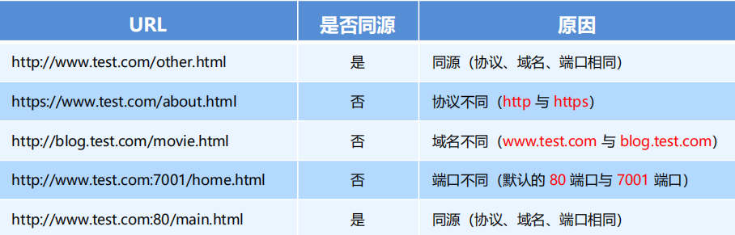
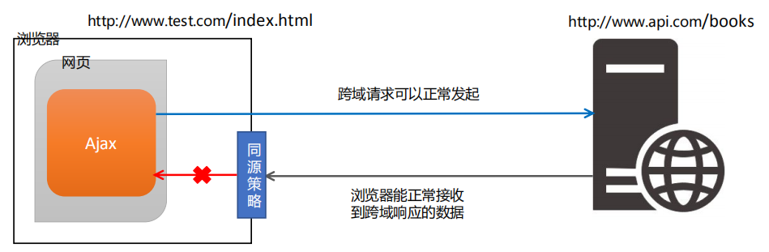
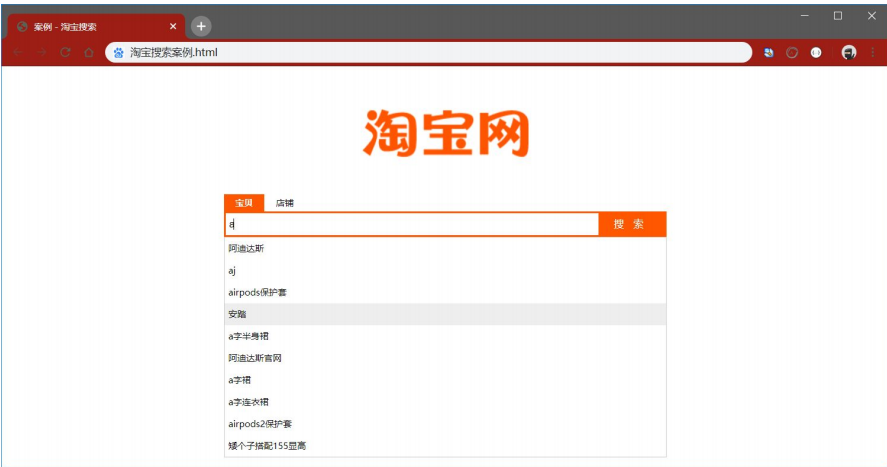
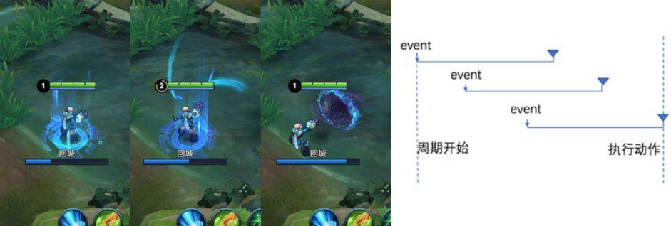
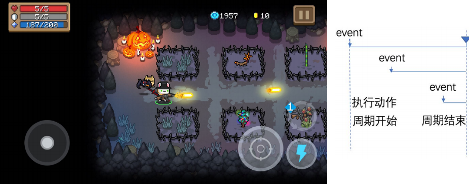
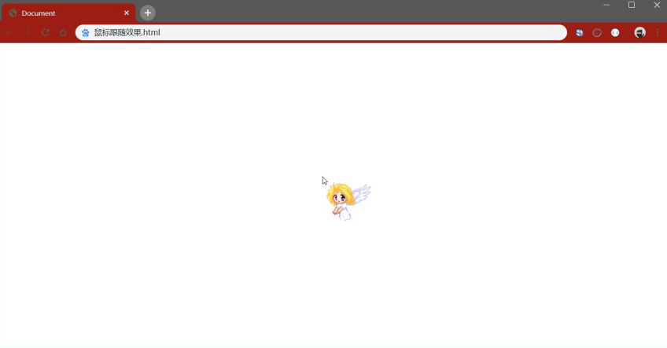

# 目标

- 能够知道什么是同源策略和跨域
- 能够知道什么是`JSONP`
- 能够说出`JSONP`的实现原理
- 能够知道防抖和节流的概念

# 同源策略(⭐⭐⭐)

## 什么是同源

如果两个页面的协议，域名和端口都相同，则两个页面具有**相同的源**。

例如，下表给出了相对于 http://www.test.com/index.html 页面的同源检测：



## 什么是同源策略

**同源策略**（英文全称 Same origin policy）是**浏览器**提供的一个**安全功能**

**`MDN` 官方给定的概念**：同源策略限制了从同一个源加载的文档或脚本如何与来自另一个源的资源进行交互。这

是一个用于隔离潜在恶意文件的重要安全机制

通俗的理解：浏览器规定，A 网站的 JavaScript，不允许和非同源的网站 C 之间，进行资源的交互，例如：

① 无法读取非同源网页的 Cookie、LocalStorage 和 IndexedDB

② 无法接触非同源网页的 DOM

③ 无法向非同源地址发送 Ajax 请求

# 跨域(⭐⭐⭐)

## 什么是跨域

**同源**指的是两个 URL 的协议、域名、端口一致，反之，则是**跨域**

出现跨域的根本原因：**浏览器的同源策略**不允许非同源的 URL 之间进行资源的交互

网页：`http://www.test.com/index.html`

接口：`http://www.api.com/userlist`

## 浏览器对跨域请求的拦截



**注意：**浏览器允许发起跨域请求，但是，跨域请求回来的数据，会被浏览器拦截，无法被页面获取到！

## 如何实现跨域数据请求

现如今，实现跨域数据请求，最主要的两种解决方案，分别是 `JSONP` 和 `CORS`。

**`JSONP`：**出现的早，兼容性好（兼容低版本IE）。是前端程序员为了解决跨域问题，被迫想出来的一种临时解决方案。**缺点**是只支持 `GET` 请求，不支持 `POST` 请求。

**`CORS`：**出现的较晚，它是 `W3C` 标准，属于跨域 `Ajax` 请求的根本解决方案。支持 `GET` 和 `POST` 请求。**缺点**是不兼容某些低版本的浏览器

# `JSONP`

## 什么是`JSONP`(⭐⭐⭐)

`JSONP` (`JSON with Padding`) 是 `JSON` 的一种“使用模式”，可用于解决主流浏览器的跨域数据访问的问题。

## `JSONP`的实现原理(⭐⭐⭐)

由于浏览器同源策略的限制，网页中无法通过 Ajax 请求非同源的接口数据。但是 `<script>` 标签不受浏览器同

源策略的影响，可以通过 `src` 属性，请求非同源的 `js` 脚本。

因此，`JSONP` 的实现原理，就是通过 `<script>` 标签的 `src` 属性，请求跨域的数据接口，并通过**函数调用**的形式，接收跨域接口响应回来的数据

## 自己实现一个简单的`JSONP`

定义一个`success`回调函数：

```html
 <script>
     function success(data) {
     console.log('获取到了data数据：')
     console.log(data)
     }
 </script>
```

通过 `<script>` 标签，请求接口数据：

```html
<script src="http://ajax.frontend.itheima.net:3006/api/jsonp?callback=success&name=zs&a
ge=20"></script>
```

## `JSONP`的缺点

由于 `JSONP` 是通过 `<script>` 标签的 `src` 属性，来实现跨域数据获取的，所以，`JSONP` 只支持 `GET` 数据请求，不支持 POST 请求。

**注意：** **`JSONP` 和 Ajax 之间没有任何关系**，不能把 `JSONP` 请求数据的方式叫做 Ajax，因为 `JSONP` 没有用到

`XMLHttpRequest` 这个对象

## `jQuery`中的`JSONP`

`jQuery` 提供的 `$.ajax()` 函数，除了可以发起真正的 `Ajax` 数据请求之外，还能够发起 `JSONP` 数据请求，例如：

```javascript
$.ajax({
     url: 'http://ajax.frontend.itheima.net:3006/api/jsonp?name=zs&age=20',
     // 如果要使用 $.ajax() 发起 JSONP 请求，必须指定 datatype 为 jsonp
     dataType: 'jsonp',
     success: function(res) {
     console.log(res)
     }
})
```

默认情况下，使用 `jQuery` 发起 `JSONP` 请求，会自动携带一个 c`allback=jQueryxxx` 的参数，`jQueryxxx` 是随机生成的一个回调函数名称

### 自定义参数及回调函数名称

在使用 `jQuery` 发起 `JSONP` 请求时，如果想要自定义 `JSONP` 的**参数**以及**回调函数名称**，可以通过如下两个参数来指定：

```javascript
$.ajax({
     url: 'http://ajax.frontend.itheima.net:3006/api/jsonp?name=zs&age=20',
     dataType: 'jsonp',
     // 发送到服务端的参数名称，默认值为 callback
     jsonp: 'callback',
     // 自定义的回调函数名称，默认值为 jQueryxxx 格式
     jsonpCallback: 'abc',
     success: function(res) {
     console.log(res)
     }
})
```

###  `jQuery`中`JSONP`的实现过程

`jQuery` 中的 `JSONP`，也是通过 `<script>` 标签的 `src` 属性实现跨域数据访问的，只不过，`jQuery` 采用的是**动态创建和移除标签**的方式，来发起 `JSONP` 数据请求。

- 在发起 `JSONP` 请求的时候，动态向 `<header>` 中 append 一个 `<script>` 标签；

- 在 `JSONP` 请求成功以后，动态从 `<header>` 中移除刚才 `append` 进去的 `<script>` 标签；

# **案例** **–** 淘宝搜索

## 要实现的`UI`效果



## 获取用户输入的搜索关键词

为了获取到用户每次按下键盘输入的内容，需要监听输入框的 `keyup` 事件，示例代码如下：

```javascript
// 监听文本框的 keyup 事件
$('#ipt').on('keyup', function() {
     // 获取用户输入的内容
     var keywords = $(this).val().trim()
     // 判断用户输入的内容是否为空
     if (keywords.length <= 0) {
     return
     }
     // TODO：获取搜索建议列表
})
```

## 封装`getSuggestList`函数

将获取搜索建议列表的代码，封装到 `getSuggestList` 函数中，示例代码如下：

```javascript
function getSuggestList(kw) {
     $.ajax({
     // 指定请求的 URL 地址，其中，q 是用户输入的关键字
     url: 'https://suggest.taobao.com/sug?q=' + kw,
     // 指定要发起的是 JSONP 请求
     dataType: 'jsonp',
     // 成功的回调函数
     success: function(res) { console.log(res) }
     })
 }
```

## 渲染建议列表的`UI`结构

### 定义搜索建议列表

```html
 <div class="box">
     <!-- tab 栏区域 -->
     <div class="tabs"></div>
     <!-- 搜索区域 -->
     <div class="search-box"></div>
     <!-- 搜索建议列表 -->
     <div id="suggest-list"></div>
 </div>
```

### 定义模板结构

- 创建`script`标签
- 设置`type`属性为 `text/html` 设置模板`id`
- 利用 `each` 遍历结构

```html
<!-- 模板结构 -->
<script type="text/html" id="tpl-suggestList">
     {{each result}}
     <div class="suggest-item">{{$value[0]}}</div>
     {{/each}}
</script>
```

### 定义渲染模板结构的函数

- 定义函数，接收一个参数，就是服务器返回的数据
- 判断返回的数据长度是否大于0
- 如果没有，将页面的列表清空，并且进行隐藏
- 如果有数据，调用模板的 `template` 函数，传入`id`和数据
- 返回渲染好的`html`字符串，然后放入容器中

```javascript
 // 渲染建议列表
function renderSuggestList(res) {
     // 如果没有需要渲染的数据，则直接 return
     if (res.result.length <= 0) {
     return $('#suggest-list').empty().hide()
     }
     // 渲染模板结构
     var htmlStr = template('tpl-suggestList', res)
     $('#suggest-list').html(htmlStr).show()
}
```

## 搜索关键词为空时隐藏搜索建议列表

- 注册`keyup`事件
- 判断输入框的内容是否为空
- 如果为空隐藏列表

```javascript
$('#ipt').on('keyup', function() {
     // 获取用户输入的内容
     var keywords = $(this).val().trim()
     // 判断用户输入的内容是否为空
     if (keywords.length <= 0) {
     // 如果关键词为空，则清空后隐藏搜索建议列表
     return $('#suggest-list').empty().hide()
     }
     getSuggestList(keywords)
})
```

# 防抖&节流

## 输入框防抖

### 什么是防抖(⭐⭐⭐)

**防抖策略**（`debounce`）是当事件被触发后，延迟 `n` 秒后再执行回调，如果在这 `n` 秒内事件又被触发，则重新计时。



**好处：**能够保证用户在频繁触发某些事件的时候，不会频繁的执行回调，只会被执行一次

### 防抖的应用场景

用户在输入框中连续输入一串字符时，可以通过防抖策略，只在输入完后，才执行查询的请求，这样可以有效减

少请求次数，节约请求资源；

### 实现输入框的防抖

- 防抖动的 timer
- 定义防抖的函数，函数里面定义一个延时器，在演示器里面调用发起`JSONP`的请求
- 在触发 `keyup` 事件时，立即清空 `timer`，然后调用防抖的函数

```javascript
var timer = null // 1. 防抖动的 timer
function debounceSearch(keywords) { // 2. 定义防抖的函数
     timer = setTimeout(function() {
     // 发起 JSONP 请求
     getSuggestList(keywords)
     }, 500)
 }
$('#ipt').on('keyup', function() { // 3. 在触发 keyup 事件时，立即清空 timer
 clearTimeout(timer)
 // ...省略其他代码
 debounceSearch(keywords)
 })
```

### 缓存搜索的建议列表

#### 定义全局缓存对象

```javascript
 // 缓存对象
 var cacheObj = {}
```

#### 将搜索结果保存到缓存对象中

- 键就是用户输入的关键字，值就是服务器返回的value

```javascript
// 渲染建议列表
function renderSuggestList(res) {
     // ...省略其他代码
     // 将搜索的结果，添加到缓存对象中
     var k = $('#ipt').val().trim()
     cacheObj[k] = res
}
```

#### 优先从缓存中获取搜索建议

- 在发起请求之前，先判断缓存中是否有数据

```javascript
// 监听文本框的 keyup 事件
$('#ipt').on('keyup', function() {
     // ...省略其他代码
     // 优先从缓存中获取搜索建议
     if (cacheObj[keywords]) {
     return renderSuggestList(cacheObj[keywords])
     }
     // 获取搜索建议列表
     debounceSearch(keywords)
 })
```

## 节流

### 什么是节流(⭐⭐⭐)

**节流策略**（`throttle`），顾名思义，可以减少一段时间内事件的触发频率。



### 节流的应用场景

① 鼠标连续不断地触发某事件（如点击），只在单位时间内只触发一次；

② 懒加载时要监听计算滚动条的位置，但不必每次滑动都触发，可以降低计算的频率，而不必去浪费 CPU 资源；

### **节流案例** **–** 鼠标跟随效果

#### `UI`效果



#### 渲染`UI`结构并美化样式

```html
<!-- UI 结构 -->

/* CSS 样式 */
html, body {
 margin: 0;
 padding: 0;
 overflow: hidden; }
#angel {
 position: absolute; }
```

#### 不使用节流时实现鼠标跟随效果

- 获取图片元素
- 注册 `mousemove`事件
- 设置图片的位置

```javascript
$(function() {
     // 获取图片元素
     var angel = $('#angel')
     // 监听文档的 mousemove 事件
     $(document).on('mousemove', function(e) {
     // 设置图片的位置
     $(angel).css('left', e.pageX + 'px').css('top', e.pageY + 'px')
     })
})
```

#### 节流阀的概念

高铁卫生间是否被占用，由红绿灯控制，红灯表示被占用，绿灯表示可使用。

假设每个人上卫生间都需要花费5分钟，则五分钟之内，被占用的卫生间无法被其他人使用。

上一个人使用完毕后，需要将红灯**重置**为绿灯，表示下一个人可以使用卫生间。

下一个人在上卫生间之前，需要**先判断控制灯**是否为绿色，来知晓能否上卫生间。

节流阀为空，表示可以执行下次操作；不为空，表示不能执行下次操作。

当前操作执行完，必须将节流阀**重置**为空，表示可以执行下次操作了。

每次执行操作前，必须**先判断节流阀是否为空**。

#### 使用节流优化鼠标跟随效果

- 预定义一个 timer **节流阀**
- 当设置了鼠标跟随效果后，**清空** **timer** **节流阀**，方便下次开启延时器
- 执行事件的时候判断**节流阀**是否为空，如果不为空，则证明距离上次执行间隔不足16毫秒

```javascript
$(function() {
     var angel = $('#angel')
     var timer = null // 1.预定义一个 timer 节流阀
     $(document).on('mousemove', function(e) {
     if (timer) { return } // 3.判断节流阀是否为空，如果不为空，则证明距离上次执行间隔不足16毫秒
     timer = setTimeout(function() {
     $(angel).css('left', e.pageX + 'px').css('top', e.pageY + 'px')
     timer = null // 2.当设置了鼠标跟随效果后，清空 timer 节流阀，方便下次开启延时器
     }, 16)
     })
})
```

## 总结防抖和节流的区别

- **防抖**：如果事件被频繁触发，防抖能保证只有最有一次触发生效！前面 N 多次的触发都会被忽略！

- **节流**：如果事件被频繁触发，节流能够减少事件触发的频率，因此，节流是有选择性地执行一部分事件！